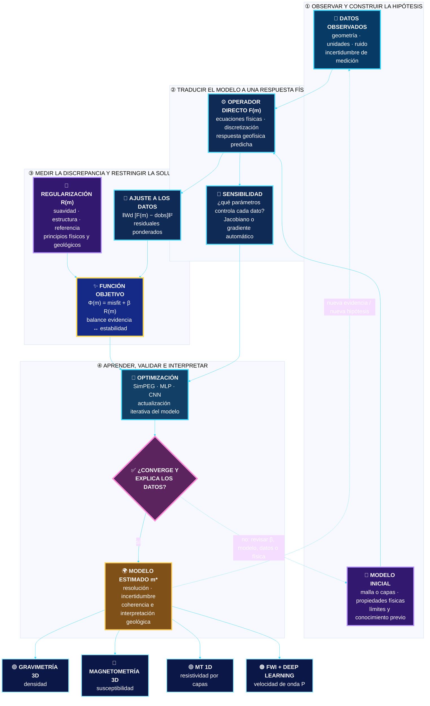

<div align="center">

# Curso teórico práctico sobre inversión geofísica en Python

### Del dato observado al modelo del subsuelo

**Gravimetría · Magnetometría · MT 1D · FWI · SimPEG · Aprendizaje profundo guiado por física**

[](https://www.python.org/)
[](https://jupyter.org/)
[](https://simpeg.xyz/)
[](#ruta-científica)
[](https://www.youtube.com/watch?v=gAqL1yqmJJw&list=PLBrkSquHNyNM)

</div>

<p align="center"><em>Un laboratorio reproducible para explorar la relación</em></p>

$$
\mathbf{d} = \mathcal{F}(\mathbf{m}) + \boldsymbol{\varepsilon}
$$

<p align="center"><em>y reconstruir modelos físicos con ajuste de datos, regularización y aprendizaje profundo.</em></p>


## Qué encontrarás

Este repositorio reúne los materiales del **Curso teórico práctico sobre inversión geofísica en Python**, dirigido a la comunidad científica. Integra fundamentos del problema inverso con ejercicios guiados, casos sintéticos y datos reales.

El curso fue dirigido por **Ana Mantilla, Javier Torres y León Suárez**, con **PhD Henry Arguello Fuentes** como investigador principal. Fue organizado por los grupos de investigación **HDSP, GIGBA y CPS** en el marco del **Contrato No. 045-2025** financiado por el Ministerio de Ciencia, Tecnología e Innovación (MINCIENCIAS) y la **Agencia Nacional de Hidrocarburos (ANH)**.

## Ruta científica

| Sesión | Eje | Del dato al modelo | Material |
|:--:|---|---|---|
| 01 | Fundamentos | No unicidad, sensibilidad, incertidumbre y regularización | [Abrir](materials/session-01/) |
| 02 | Gravimetría 3D | Anomalía residual → contraste de densidad | [Abrir](materials/session-02/) |
| 03 | Magnetometría 3D | Anomalía TMI → susceptibilidad magnética | [Abrir](materials/session-03/) |
| 04 | MT 1D guiada por física | Impedancia Z<sub>xy</sub> → resistividad por capas | [Abrir](materials/session-04/) |
| 05 | FWI: fundamentos | Registros sísmicos → modelo de velocidad | [Abrir](materials/session-05/) |
| 06 | FWI: entrenamiento | *Shots* y pesos preentrenados → velocidad de onda P | [Abrir](materials/session-06/) |
| 07 | Reto integrador MT 1D | Datos sintéticos → inversión profunda no supervisada | [Abrir](materials/session-07/) |

## Arquitectura conceptual



La inversión se plantea como un **ciclo iterativo y auditable**: los datos observados y la hipótesis física alimentan el operador directo; la discrepancia entre datos predichos y observados se combina con regularización y conocimiento previo; el modelo se actualiza hasta alcanzar convergencia, y finalmente se evalúan resolución, incertidumbre y coherencia geológica.

## Clases grabadas

<div align="center">

### ▶️ [Ver la lista de reproducción completa en YouTube](https://www.youtube.com/watch?v=gAqL1yqmJJw&list=PLBrkSquHNyNM)

[](https://www.youtube.com/watch?v=zWDQ6DE8mWs&list=PLBrkSquHNyNM&index=4&t=112s)

**[▶ Reproducir este video desde el minuto 1:52](https://www.youtube.com/watch?v=zWDQ6DE8mWs&list=PLBrkSquHNyNM&index=4&t=112s)**

*Revisa las sesiones en orden y utiliza los notebooks de este repositorio como laboratorio práctico.*

</div>

## Inicio rápido

```bash
git clone https://github.com/Anagabrielamantilla/inversion-geofisica-python.git
cd inversion-geofisica-python
python -m venv .venv
source .venv/bin/activate
python -m pip install -r requirements.txt
jupyter lab
```

Abre los notebooks desde su propia carpeta de sesión para conservar las rutas relativas a los datos. Varios cuadernos fueron diseñados para **Google Colab**; las celdas de montaje de Drive y las rutas `/content/...` deben ajustarse si se ejecutan localmente. Las tareas de FWI pueden requerir GPU y conjuntos externos indicados dentro de cada notebook.

## Estructura

```text
.
├── docs/
│   ├── brochure.pdf          # pieza publicitaria y programa original
│   └── assets/               # publicidad e infografía conceptual
├── materials/
│   ├── session-01/           # introducción y regresión lineal
│   ├── session-02/           # inversión gravimétrica
│   ├── session-03/           # inversión magnetométrica
│   ├── session-04/           # inversión MT 1D
│   ├── session-05/           # introducción a FWI
│   ├── session-06/           # FWI y modelos preentrenados
│   └── session-07/           # reto de inversión MT 1D
├── CITATION.cff
└── requirements.txt
```

## Programa anunciado

La pieza publicitaria presenta una intensidad total de **18 horas**:

- **Bloque 1 — Introducción al problema inverso (3 h):** datos, modelos, incertidumbre, problema directo, no unicidad, ruido, sensibilidad, ajuste y regularización.
- **Bloque 2 — Inversión gravimétrica con SimPEG (3 h):** malla 3D, celdas activas, modelos sintéticos, datos reales y visualización en ParaView.
- **Bloque 3 — Inversión magnetométrica con SimPEG (3 h):** TMI, campo inductor, susceptibilidad, casos sintéticos y reales.
- **Bloque 4 — Inversión profunda guiada por física para MT 1D (3 h):** operador directo diferenciable, MLP con *skip connections* y entrenamiento no supervisado.
- **Bloques 5 y 6 — Inversión de onda completa (6 h):** adquisición, ecuación de onda acústica, aprendizaje supervisado, hiperparámetros y pesos preentrenados.

Consulta el [folleto original](docs/brochure.pdf) para preservar la información institucional y el programa completo.

> **Nota histórica.** La publicidad anuncia el curso del **3 al 11 de agosto**, de **1:00 p. m. a 3:00 p. m.**, en el salón 404 del edificio E3T, con modalidad virtual complementaria. Los enlaces de asistencia e inscripción del evento se consideran históricos y no se reproducen como llamadas activas.

## Datos, reproducibilidad y alcance

- Los conjuntos `.npy`, `.txt` y `.edi` disponibles en la carpeta fuente se mantienen junto a su sesión.
- Algunos notebooks hacen referencia a recursos externos o a nombres de archivos que no forman parte del paquete original; revisa sus celdas de preparación antes de ejecutar.
- Los resultados numéricos pueden variar por versión de biblioteca, *hardware*, semilla y tolerancias del optimizador.
- `requirements.txt` documenta el conjunto común de bibliotecas; cada notebook sigue siendo la referencia para requisitos específicos.

## Crédito institucional

Material asociado al proyecto **“Nuevas tecnologías computacionales para el procesamiento e inversión conjunta de gravimetría, magnetometría y magnetotelúrica mediante aprendizaje profundo guiado por principios físicos para la caracterización multicriterio”**.

Organizan: **HDSP · GIGBA · CPS**, con participación institucional de la **Universidad Industrial de Santander**, la **Escuela de Ingenierías Eléctrica, Electrónica y de Telecomunicaciones**, la **Facultad de Ciencias** y la **Agencia Nacional de Hidrocarburos**.

## Uso y atribución

Este repositorio conserva material docente y datos del curso. **No se declara una licencia abierta**: todos los derechos permanecen con sus titulares. Antes de reutilizar, modificar o redistribuir contenido, confirma los permisos aplicables y cita a las personas e instituciones responsables mediante [`CITATION.cff`](CITATION.cff).

---

<div align="center">

**Explora · modela · invierte · valida**

</div>
